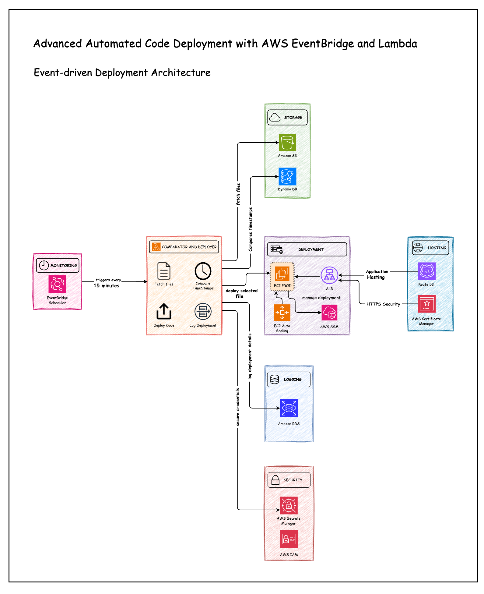

# aws-eventbridge-lambda-deployment

# 🌟 Advanced Automation Deployment using AWS EventBridge and Lambda 🚀

## ☁️✅ Event-driven Deployment Architecture

“Imagine automating your code deployment with zero downtime, only triggering updates when absolutely necessary. ” That’s exactly what I achieved with AWS EventBridge and Lambda!”

Excited to share my latest project, where I implemented a fully automated, scalable deployment process using AWS EventBridge, Lambda, and other powerful AWS services. This solution highlights the deep technical work behind the deployment process, ensuring security, scalability, and efficiency across all stages.

## Project Workflow Overview
✅ **EventBridge Scheduler** triggers the Lambda function every 15 minutes to monitor S3 for new uploads.  
✅ **Lambda** fetches and sorts files from S3, comparing timestamps with DynamoDB to identify new files for deployment.  
✅ **Deploys** the application code to EC2, replacing old source files with the new one.  
✅ **Updates** DynamoDB with the latest timestamp.  
✅ **Logs** deployment details in RDS.

## Key Features and Implementation

### 🖥️ AWS Lambda:
✅ Built manually in Python for automation.  
✅ Automates the process of sorting and comparing code files based on timestamps.  
✅ Deploys the selected code to EC2 using AWS Systems Manager (SSM).  
✅ Logs deployment details into Amazon RDS.  
✅ Adds the latest timestamp as a record in DynamoDB for comparison during future deployments when new code is uploaded.

✅ **AWS Secrets Manager:** Securely stores credentials for EC2 and RDS to maintain strong security protocols.     
✅ **Amazon S3:** Acts as a centralized deployment source. Code files are versioned, and the new code is deployed in the EC2 Prod Servers.    
✅ **AWS EventBridge Scheduler:** Runs every 15 minutes to trigger Lambda for monitoring S3 and automating the deployment process.     
✅ **Amazon EC2:** Hosts the deployed application code via Apache Web Server, replacing old files with new ones for seamless updates.     
✅ **Amazon RDS:** Stores deployment logs for auditing purposes.    

## Key Outcomes and Takeaways
✅ Gained hands-on experience with event-driven architecture using AWS EventBridge.  
✅ Leveraged Amazon S3 as a centralized deployment repository and distributed version control system.  
✅ Developed a scalable, secure multi-service AWS solution.  
✅ Automated code deployment with reliable logging, ensuring real-time tracking and auditing.  
✅ Expanded skills in cloud automation, security, and server management.

## Architecture Diagram

This project showcases the power of integrating multiple AWS services to automate deployments, making the process faster, more reliable, and fully traceable. 🌟🚀

Feel free to connect with me on [LinkedIn](https://www.linkedin.com/in/vignesh-aws-devops/)  
